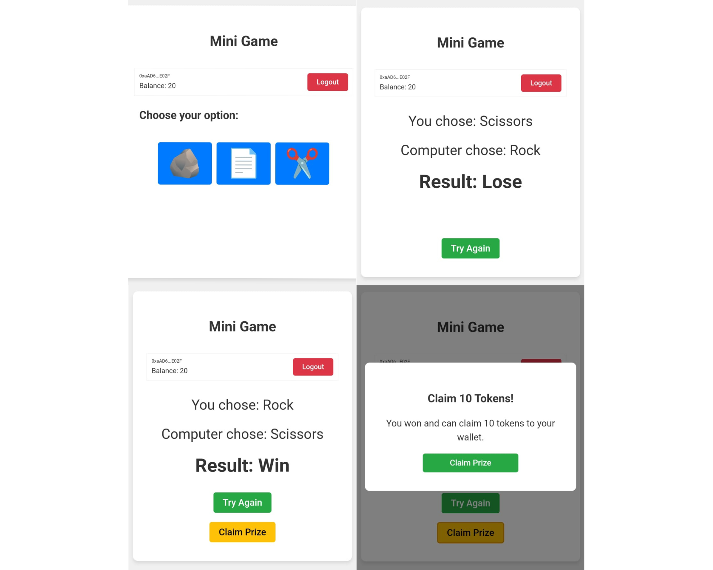

# Rock Paper Scissors Game - Telegram Mini App

## Overview

This is a simple Rock Paper Scissors game built as a Telegram Mini App. Players compete in the classic game of rock-paper-scissors, and if they win, they can claim a token prize directly within the app. The game mechanics follow the traditional rules of rock-paper-scissors, offering users an engaging way to play and earn.

## Features

- Classic Gameplay: The game operates like any typical rock-paper-scissors game—players choose between rock, paper, or scissors, and compete against the app's random choices.
- Token Rewards: Players who win a match can claim a token as a prize.
- Wallet Integration: Users log in using their email to connect to their wallet, enabling token claims.
- Telegram Mini App: Available directly within Telegram, offering a smooth and easy-to-access gaming experience without additional app downloads.

## Installation & Usage

This app is designed for Telegram and can be accessed via a Telegram bot or Mini App link. Users must log in using their email to authenticate their wallet and claim prizes.
